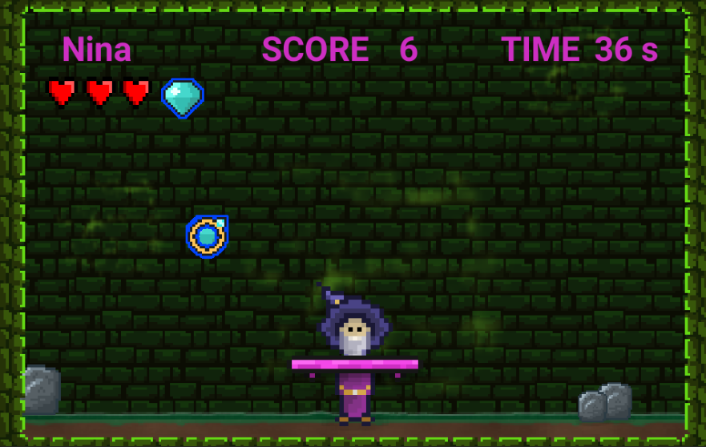

# 20CandyCatcher-nima

### Project description:

* This project consists of a 2D variation of the Candy Catcher game. The aim of the game is to collect a huge amount of "good drops" (in order to get an awesome score of course :D) and to avoid "bad drops".

### Development platform:

* Windows 10
* Unity 2020.3.18f1
* Visual Studio 2019

### Target platform:

* 2D WebGL (960 x 600)

### Visuals:

### Necessary setup/execution steps: 

* WebGL-Link: https://5ahmnm2122.github.io/20CandyCatcher-nima/

### Third party material:

* Environment: https://assetstore.unity.com/packages/2d/free-2d-mega-pack-177430
* 2D Outline: https://assetstore.unity.com/packages/vfx/shaders/2d-sprite-outline-109669
* Heart Sprite: https://www.nicepng.com/ourpic/u2q8a9t4o0y3u2t4_8bit-heart-png-free-library-heart-8-bits/

### Project state:

* 80 % 

### Limitations: 

* none

### Lessons Learned:

* revision of further c# functions
* revision of scriptable objects
* revision of arrays

	
Copyright by nima